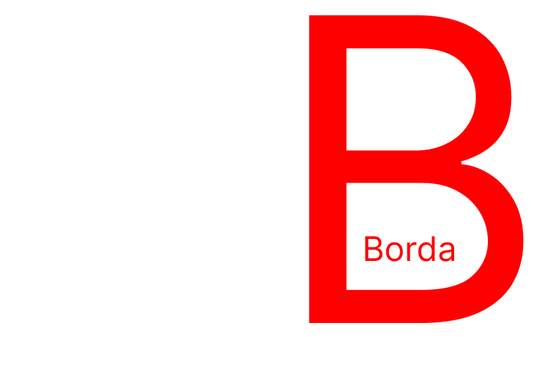

# ScoreBorda 5

The ultimate decision making tool for the troubled mind

[View ScoreBorda v5](https://score-borda.vercel.app/)

[See the Previous Version](https://gitlab.com/JonoAugustine/ScoreBorda)

## Definitions

### Candidates: the object of your indecision

- Whether people, clothes, insurance plans, or quite literally anything else.
SB works to aid you in understanding how you feel about about these candidates.
- Candidates consist of a name, score, and set of feature scores.

### Features: aspects of candidates

- Features help SB understand what is most important to you. They can be anything from
red to votes for president of space to likes kittens; as long as it describes some aspect of a candidate, it's a valid feature.
- Features consist of a name and weight

### Bordas: The solution

- The Borda is the system by which Features and Candidates are scored and ranked against each other. 
A series of binary choices that help the program (as well as the user) understand where Features 
& Candidates stand in respect to each other. By presenting only two options in each comparison,
the Borda is able to remove much of the overwhelming and confusing aspects of comparing and ranking several choices at once.

## Running Locally

### Setup

You'll need some environment variables to get the MALBorda working:

```properties
VERCEL_ENV="local"
VERCEL_PROJECT_PRODUCTION_URL="localhost:3000"
NEXT_PUBLIC_MAL_CLIENT_ID="<get at https://myanimelist.net/apiconfig>"
MAL_CLIENT_SECRET="<get at https://myanimelist.net/apiconfig>"
JWT_SECRET="<random string>"
```

### Running

```bash
pnpm install
pnpm dev
```

## Roadmap

- Signed feature weights
  - Allow feature weights to be negative or positive based on user input
- Improve button layouts
- Local Data persistance
- Remote Data persistance
- Candidate-specific Features

## MAL Borda
